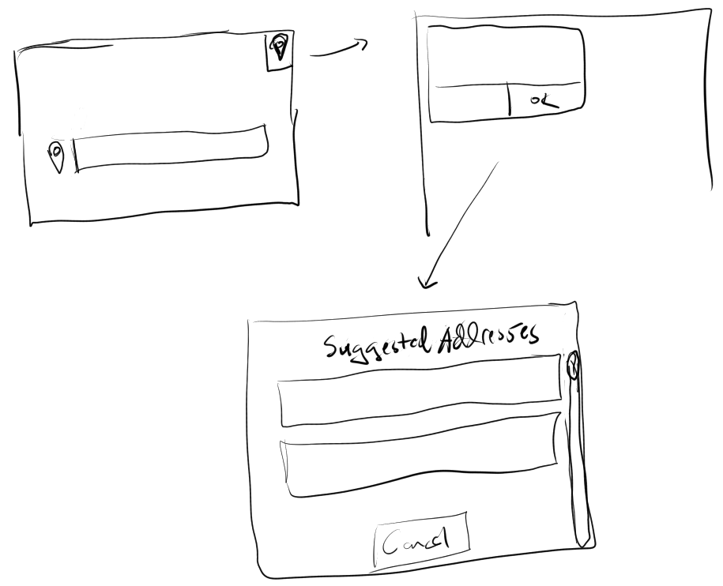

### Feature Requests
- [ ] (easy) extra fields on event screen(tag info)
- [x] (easy) add address autocomplete
  - assuming using Google Maps(may cost money, may be free)
- [ ] (hard) upload multiple photos
  - requires front end and backend work
  - front end has to store/loop through upload process
  - backend has to process the sets or streams of multiple files
    but may not be different from uploading multiple events which can also have several images per event
- [ ] (medium) update event workflow so don't have to save event before adding images
  - there is a reason for this, it's a dumb code on my part with regard to the saving/communication between top navbar and body(separate components)
    easier to just leave/saves data and come back
  - investigate being able to save without leaving or just automatically save the event... bad thing is if it's empty shouldn't save,
    would have to delete it which is a capability

#### Reverse geocode workflow

- [x] click on icon asks to share location
- [x] get coordinates from device
- [x] send to Google Reverse Geocode service
  - used JavaScript one eg. part of maps not the server side one
- [x] show list of possible addresses
- [x] on select, add to search field (why not just go ahead)
  - just selects address you choose, thought about "what if you want to slightly change it"
    - can delete I guess