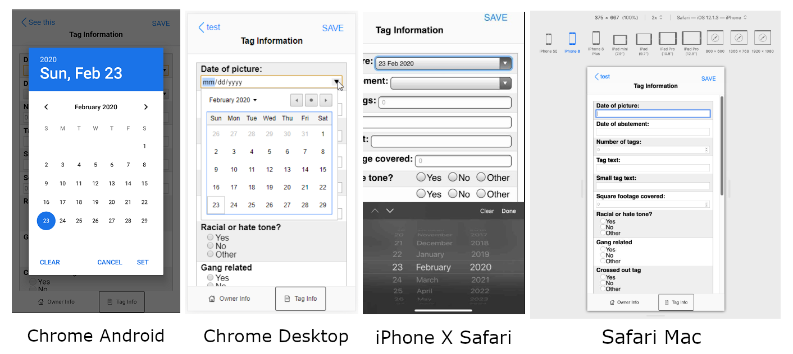

### GitHub Pages deployment
- [ ] consider better way eg. a dedicated repo or some kind of build process

### Flaw
- [ ] the timestamp trick for unique images that were previously deleted by name(problematic when files have same names) doesn't work when you sync down
    - because the time stamp is a temporary/local thing not maintained in remote side, may add new column to remote side
    - the main issue is not able to include key from column queries, you can do a key only column but then need to match with data/double calls
    - in a way this is an edge case problem but arguable if a phone was reset or something... well usually camera file names are date-based so you would still have unique file names

### Performance
- regarding Safari, storage issue should not be a problem, according to this [webkit spec](https://trac.webkit.org/changeset/237700/webkit/), the size limitation for Safari is half the free space if less than 1GB or at least 500MB
- [ ] address sync performance issue
    - [ ] large images not needed since only small thumbnails are used, however, they should be available for the click thumbnail to view full size
        - but that can be done on demand/cached locally in session
    - [ ] at somepoint - address the sync pagination
- [ ] pagination issue with Dexie eg. 36 rows being pulled to load 36 images throws [max ipc length](https://stackoverflow.com/questions/52717593/maximum-ipc-message-size-exceeded) issue
    - [ ] limit to 6 at a time
    - [ ] need to add scroll load
        - issue with this is if you were to udpate state, it would re-render the page, vs. just appending content to the current rendered view

### Feature to open large image from thumbnail
- [ ] put a warning first time opening big picture(from thumbnail click) that it will use data

### Add in way to delete addresses
- [ ] this should delete all related data as well eg. the tags, tagInfo, ownerInfo

### UX
- [ ] typing into login field seems whack, probably due to state being tied to `onKeyUp`

### Fixing Safari
- [ ] look into weird alignment of add tag buttons in bottom navbar
- [ ] height issue in iPad

### TODOs in code, just search, will find a lot related to optimizing/best practices/etc...

### Functionality
- [ ] cancelling camera upload process leaves button not clickable/state not updated
- [ ] automatic cache clearing vs. manual "Software Update" gear icon

### Display
- [ ] use perfect square/portioning for photos eg. tiles

### Slack tasks
- [ ] Extra - On Tag Info: For date of picture and date of abatement - is it possible to add a drop down calendar to select the date? If not, that's totally fine
    - this is probably browser specific but it's there/I've seen it work in Chrome and Safari since it's a date time type input, proof below Chrome vs. Safari
    - it mostly works but in some cases it doesn't work, proven to work on device and chrome browser
    - this will need some kind of library for the date picker maybe npm has it/reactjs
        - yeah Firefox and Safari don't support it apparently
    - this also works on iPad from testing
    

### Sync
- [ ] consider better way than empty pulldown or not empty overwrite up
- [ ] some kind of diffing
- [ ] some kind of down sync pagination

## Device/OS/Browser

### Safari
These are visual problems noted on Safari when testing with an iPhone X(AWS Device Farm)
Unfortunately there are quite a few problems visually
- [ ] the bottom navbar is cut off
    - set by JS, it looks good from a tester with a real device, doesn't look good in SauceLabs real devices,
        but looks good in responsive mode Safari
- [ ] bottom navbar items not veritcally centered(flex)

### Extra
- [ ] storage persistence for estimates on available storage should that be a problem
- [ ] remove previewed files(don't want to upload)
- [ ] sometimes there are some `unmounted state` errors
- [ ] fix double promises(`Promise` inside `async` function)
- [ ] caching intent eg. user selects a bunch of pictures for upload/but can't upload because not logged in
- [ ] change how logic works regarding not pulling from `Dexie` all the time, use state variables
- [ ] multi file select feature for add tags

### Optional
- [ ] adding in auto complete for address search, not hard but concern is cost/necessary
- [ ] recaptcha on login, not sure if DDOS is a concern
- [ ] way to register accounts, currently done manually eg. on Node side
- [ ] self location with `navigator` and then use reverse geocode to get address

### Research
- [ ] using raw images over base64
- [ ] dynamic proxy based on environment, may be tied to build script altready in `package.json`
- [ ] the mockup didn't show other options for address like state/zip so I guess it's just for KC?
- [ ] better way with dealing collapsing height due to device soft keyboard

### Good pratice
- [ ] don't develop on live url
    - setup staging environment somewhere other than local

## Bad UX
- [ ] trying to do something, not logged in, get taken to login, doesn't take you back to what you were doing before
- [ ] the dynamic resizing of heights due to bad state-render management and device OS(Safari bottom navbar specifically)